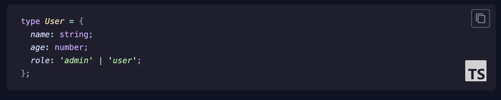
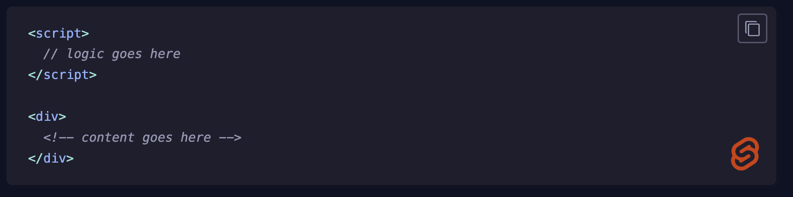
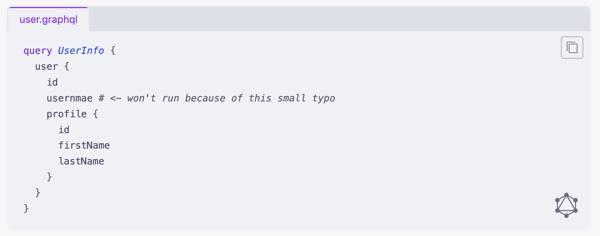

# Language Logo Plugin For Expressive Code

A plugin for Expressive Code that adds language logos (coming from [Simple Icons](https://simpleicons.org)) to code blocks.

## Examples





For more examples, see [my blog post](http://blog.dertimonius.dev/posts/til-38).

## Installation

```bash
npm install ec-lang-logo
# pnpm install ec-lang-logo
# bun install ec-lang-logo
# yarn add ec-lang-logo
```

## Usage

Add the plugin to your Expressive Code configuration:

```js
import { defineConfig } from 'astro/config';
import { pluginLanguageLogo } from 'ec-lang-logo';

export default defineConfig({
  integrations: [
    starlight({
      expressiveCode: {
        plugins: [pluginLanguageLogo()],
      },
    }),
  ],
});
```

## Configuration

The plugin accepts an optional configuration object:

```ts
pluginLanguageLogo({
  color: 'mono',           // 'mono' | 'original' | 'theme' | '#hexcolor'
  excludedLangs: [],       // Array of language identifiers to exclude
})
```

### Options

- `color`: Controls the badge color
  - `'mono'`: Adapts to theme (white for dark, black for light)
  - `'original'`: Uses the official language brand color
  - `'theme'`: Takes the code foreground color of the currently active theme
  - `'#hexcolor'`: Custom hex color (e.g., `'#ff0000'`)
- `excludedLangs`: Array of language identifiers where badges should not appear

## Per-Block Customization

You can override settings for individual code blocks using meta attributes:

```md
```js badge-color="#ff0000"
// Custom red badge
```

```md
```js badge-color="original"
// Shows the official brand color
```

```md
```ts hide-badge
// No badge on this block
```

```

### Available Meta Attributes

- `badge-color="value"`: Override the badge color for this block (takes the same values as the overall options)
- `hide-badge`: Hide the badge for this block

## Theme Support

The plugin automatically adapts mono-colored badges to your site's theme. Ensure your theme switcher uses `data-theme="light"` or `data-theme="dark"` on the `html` element.

